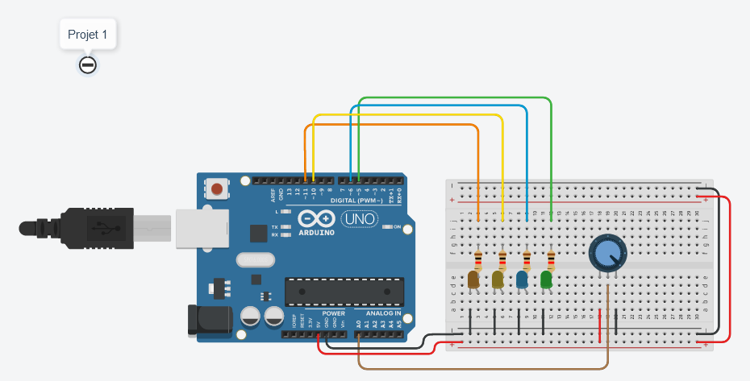

# Projet 1 : manipulation des LED  

## :clipboard: Sujet  

Pour ce mini-projet, il nous a été demandé de faire clignoter des LEDs l'une après l'autre pour donner un effet "guirlande".  

## :electric_plug: Le schéma  

Voici ce que donne ce mini-projet sur tinkercad :


On peut y voir un circuit composé de :

- Plusieurs LEDs
- Des résistances connectées avec les LEDs
- un potentiomètre pour contrôler la luminosité des LEDs

Les LEDs sont connectées aux pins 11, 10, 6, 5 de l'arduino ainsi qu'au GND.
Le potentiomètre est connecté au pin A0 de l'arduino ainsi qu'au GND et 5V.

## :computer: Le code  

```cpp
const int orange_led = 11;
const int pot_pin = A0;
int pot_value = 0;
int value = 0;

int array[4] = {11,10,6,5};


void setup()
{
  Serial.begin(9600);
  pinMode(A0, INPUT);
  pinMode(array[0], OUTPUT);
  pinMode(array[1], OUTPUT);    
  pinMode(array[2], OUTPUT);    
  pinMode(array[3], OUTPUT);    
}

void loop()
{
  
  
  for(int i=0; i<sizeof(array); i++)
  {
    // Récupération des données du potentiomètre.
    pot_value = analogRead(A0);
    // Conversion des valeurs reçus par le potentiomètre en valeurs utilisables par les LEDs.
    value = map(pot_value, 0, 1023, 0, 255);
    // Ecriture sur les LEDs de la valeur du potentiomètre convertit.
    analogWrite(array[i], value);
    delay(1000);
    // la valeur de la led est enfin mise à 0 pour donner cette effet guirlande.
    analogWrite(array[i], 0);
  }
}
```

Tout d'abord, on déclare les pins des LEDs et du potentiomètre. Puis on déclare un tableau de 4 entiers qui contiendra les pins des LEDs.
Tableau qui nous permettra de faire clignoter les LEDs en boucle.

Ensuite, dans le void loop(), on fait une boucle for qui parcourt le tableau de pin des LEDs. qui nous permet de faire clignoter les LEDs en boucle.

Dans le code, on utilise les fonctions analogRead et map pour récupérer les valeurs du potentiomètre et les convertir en valeurs utilisables par les LEDs.

## :question: La question  

### Question : A quoi sert un potentiomètre ?

Un potentiomètre est un type de résistance variable à trois bornes. Elle permet ici de régler la luminosité des LEDs en fonction de la valeur du potentiomètre.

[<-- Sommaire](../README.md) | 1 | [Projet 2 -->](../Projet_2/Projet_2.md)
