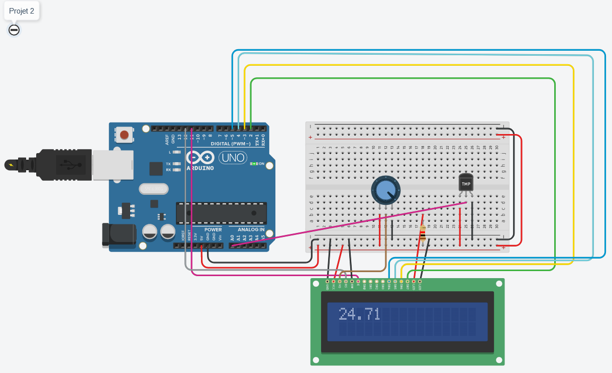

# Projet 2 : affichage des données

## :clipboard: Sujet

Pour ce mini-projet on nous demandaient de réaliser une récupération de température grâce au module TMP36 et d'afficher les données sur un LCD.

## :electric_plug: Le schéma


On peut voir sur le schéma : 
- Un Arduino Uno
- Un potentiomètre qui gère la luminosité de l'écran LCD.
- Un LCD qui permet d'afficher les valeurs de température
- Un capteur de température qui récupère une température virtuelle.

## :computer: Le code

```cpp
#include <LiquidCrystal.h>

LiquidCrystal lcd(12, 11, 5, 4, 3, 2);

const int sensorPin = A0;
int celsius = 0;
int temp_value = 0;

void setup()
{
    // set up the LCD's number of columns and rows:
    lcd.begin(16, 2);
}

void loop() {
    int reading = analogRead(sensorPin);  
    float voltage = reading * 5.0;
    voltage /= 1024.0; 
    float temperatureC = (voltage - 0.5) * 100 ;
    lcd.setCursor(0,0);
    lcd.print(temperatureC);
    delay(1000);
}
```

Dans ce code on peut voir que l'on utilise la librairie LiquidCrystal pour afficher des données sur un afficheur LCD.

On initialise le LCD avec la ligne ``LiquidCrystal(12, 11, 5, 4, 3, 2)``.

Tout d'abord avec cette ligne ``int reading = analogRead(sensorPin);`` on récupère la valeur de la température.

Les deux lignes suivantes :
```cpp
float voltage = reading * 5.0;
voltage /= 1024.0; 
``` 
permettent de convertir la valeur de la température en volts.

Cette ligne final ``float temperatureC = (voltage - 0.5) * 100 ;`` permet de récupérer la température en degrés Celsius.

Et enfin on l'affiche sur l'écran LCD grâce a ces deux lignes :
```cpp
lcd.setCursor(0,0);
lcd.print(temperatureC);
```

## :question: La question

### à quoi correspondent les différentes broches d’un écran LCD ?

The LCD has 16x2 LCD display and 16 different pins : 
- LED (Cathode) : GND
- LED (Anode) : (+5V with a resistor)
Anode et Cathode sont les broches qui permettent d'alimenter les leds du LCD.
- DB7 : 8bit Data pins
- DB6 : 8bit Data pins
- DB5 : 8bit Data pins
- DB4 : 8bit Data pins
- DB3 : 8bit Data pins
- DB2 : 8bit Data pins
- DB1 : 8bit Data pins
- DB0 : 8bit Data pins
Les pins allant de DB0 à DB7 permettent l'envoie de données binaires.
- E : Enable : Permet d'écrire dans le registre
- RW : Read/Write 
Permet de choisir entre l'écriture ou la lecture sur un écran LCD.
- RS : Register Select
Cette broche permet de séléctionner le registre utilisé pour envoyer ou non des commandes ou des données au LCD.
- Vo : Constrast adjustement
Broche relié au potentiomètre pour choisir le contraste de l'écran.
- VCC : Power supply
- GND : Ground
