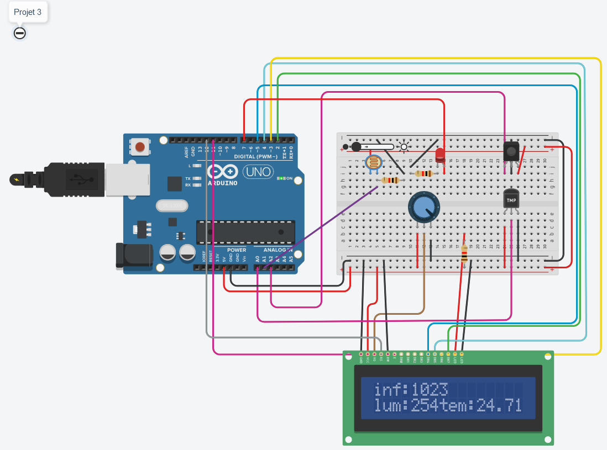
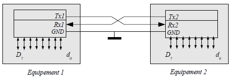

# Projet 3 : : gestion des capteurs

## :clipboard: Sujet

Ce mini-projet nous demandait de mettre en place un détecteur de température, infrarouge et de luminosité. et les informations de ses différents capteurs sont affichées sur un LCD. Et il faut aussi qu'une LED brille plus quand la luminosité est élevée et brille moins quand la luminosité est faible.

## :electric_plug: Le schéma



On peut retrouver différents composants sur ce circuit dont : 
- Un LCD
- Un potentiomètre
- Une photorésistance
- Un capteur infrarouge
- Un capteur de température
- Une LED
- Un Arduino UNO

## :computer: Le code

```cpp
#include <LiquidCrystal.h>

LiquidCrystal lcd(12, 11, 5, 4, 3, 2);

int temp_value;
int infrarouge_value;
int luminosity_value;

void setup()
{
  	pinMode(A0, INPUT);
    pinMode(A1, INPUT);
    pinMode(A2, INPUT);
    pinMode(7, OUTPUT);
    // set up the LCD's number of columns and rows:
    lcd.begin(16, 2);
}

// function that retrieve temp_value convert it to celsius for 5 volt arduino value and return it
float get_temp()
{
    int reading = analogRead(A0);  
    float voltage = reading * 5.0;
    voltage /= 1024.0; 
    float temperatureC = (voltage - 0.5) * 100 ;
    return temperatureC;
}

// function that get luminosity_value and return it
int get_luminosity()
{
    int reading = analogRead(A1);
	int outputValue = map(reading, 0, 1023, 0, 255);  
  	outputValue = (outputValue - 255)*-1;
    return outputValue;
}

// function that get infrarouge_value and return it
int get_infrarouge()
{
    int reading = analogRead(A2);
    return reading;
}

void loop()
{
  // print infrarouge_value luminosity_value and temp_value on LCD
    lcd.setCursor(0,0);
    lcd.print("inf:");
    lcd.print(get_infrarouge());
    lcd.setCursor(0,1);
    lcd.print("lum:");
    lcd.print(get_luminosity());
    lcd.setCursor(7,1);
    lcd.print("tem:");
    lcd.print(get_temp());
  	analogWrite(7, get_luminosity()); 
    delay(1000);
  	lcd.clear();
}
```

Le code ressemble à ceci ⬆️, on peut y voir différentes fonctions qui récupèrent les valeurs des capteurs et qui enfin les affichent sur le LCD dans la fonction loop.

Tout d'abord on initialise les pins des différents capteurs, le pin de la LED et le LCD.

Ensuite, avec 3 fonctions ont récupèrent les valeurs des capteurs.

Récupération des données, on a 3 fonctions qui sont : 
- get_temp() qui récupère la valeur de la température
```cpp
float get_temp()
{
    int reading = analogRead(A0);  
    float voltage = reading * 5.0;
    voltage /= 1024.0; 
    float temperatureC = (voltage - 0.5) * 100 ;
    return temperatureC;
}
```
- get-luminosity() qui récupère la valeur de la luminosité
```cpp
int get_luminosity()
{
    int reading = analogRead(A1);
    int outputValue = map(reading, 0, 1023, 0, 255);  
  	outputValue = (outputValue - 255)*-1;
    return outputValue;
}
```
- get_infrarouge() qui récupère la valeur du capteur infrarouge
```cpp
int get_infrarouge()
{
    int reading = analogRead(A2);
    return reading;
}
```

Et enfin il ne reste plus qu'à afficher les valeurs des capteurs sur le LCD.

Pour modifier l'intensité de la LED, on utilise la fonction ``analogWrite()`` qui prend en paramètre le pin de la LED et la valeur du capteur de luminosité venant de la fonction ``get-luominosity()``.

## :question: La question

### Qu’est ce que la liaison UART

La liaison UART est un protocole de communication qui permet de communiquer entre deux ordinateurs. Cette liaison est utilisée pour transmettre des données de façon asynchrone. On peut utiliser cette liaison pour faire communiquer deux arduinos ensemble. pour ce faire, il suffit de connecter les pin de l'arduino tx et rx de l'un à l'autre et de connecter les deux cartes Arduino en GND. comme sur l'image ci-dessous ⬇️  


[<-- Projet 2](../Projet_2/Projet_2.md) | 3 | [Projet 4 -->](../Projet_4/projet4.md)
