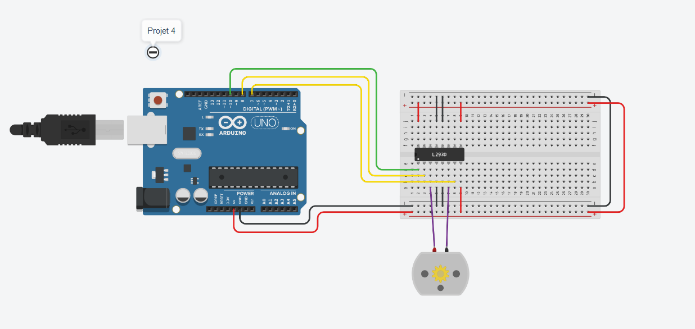
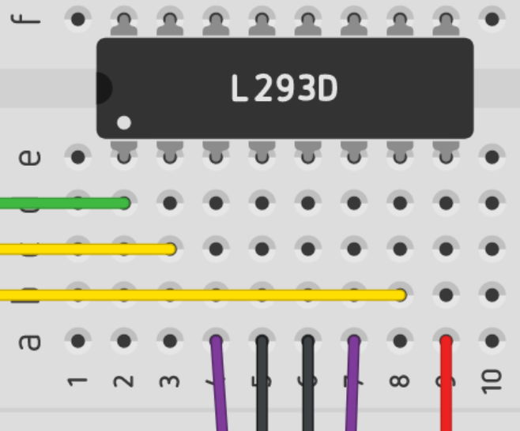

# Projet 4 : contrôler un moteur​

## :clipboard: Sujet

Mettez en place une carte Arduino avec de quoi contrôler un servo-moteur.

## :electric_plug: Le schéma



### Explication de l'image

Dans ce projet, nous avons décidé de faire un système simple avec :
- un servo-moteur **L293D**
- un moteur à courant continu

Le servo-moteur est composé de 16 Pin et peut contrôler 2 moteurs différents.

Donc un côté du servo_moteur, suffit à contrôler notre moteur. On va donc ce concentrer sur cette partie.



Voici le détails des branchements (à noter qu'il marche de la même manière sur l'autre côté du L293D) :

- Le branchement *vert* : Il sert à activer les entrées et sortie.
- Les branchements *jaunes* : Ils servent à contrôler l'entrée du courant, par conséquent le sens de rotation du moteur en sortie.
- Les branchments *violets* : Ils sont relié au moteur, c'est la sortie du courant afin de contrôler le sens du moteur.
- Les branchements *noirs* : Ils sont reliés aux pin de **TERRE**.
- Les branchements *rouges* : Ils sont reliés aux pin d'**Alimentation**.


## :computer: Le code

```c++
int motor_pin_1 = 8;
int motor_pin_2 = 7;

int enable_pin = 10;


void setup()
{
  pinMode(motor_pin_1, OUTPUT); //On active le port d'entrée 1 du L293D
  pinMode(motor_pin_2, OUTPUT); //On active le port d'entrée 2 du L293D
  pinMode(enable_pin, OUTPUT); //On active le port d'activation du L293D
  
  digitalWrite(enable_pin, HIGH); //Dès le démarrage, on active le module pour le moteur aux sorties 1 et 2.
}

void loop()
{
    //Tourne d'un sens.
    digitalWrite(motor_pin_1, HIGH);  
    digitalWrite(motor_pin_2, LOW);
    delay(1000); // Wait for 1000 millisecond(s)
    //Tourne du sens opposés.
    digitalWrite(motor_pin_1, LOW);  
    digitalWrite(motor_pin_2, HIGH);
    delay(1000); // Wait for 1000 millisecond(s)
}
```

### Explication du code

Comme on peut le comprendre grâce aux commentaires dans le code. Le programme fait une chose très simple : Il va faire tourner le moteur d'un sens pendant 1 seconde, et de l'autre sens pendant encore 1 seconde (et ainsi de suite).

Le plus important à comprendre c'est que le servo-moteur va nous permettre de contrôler l'entrée et la sortie du courant et par conséquent le sens de rotation du moteur.

Donc quand on lui dit :

```c++
digitalWrite(motor_pin_1, HIGH);  
digitalWrite(motor_pin_2, LOW);
```
On lui demande d'envoyer le courant vers le ***pin 1*** et d'envoyer en sortie au ***pin 2***.


## :question: La question

### Quels sont les différents moteurs proposés par Tinkercad ? A quoi servent-ils ?​

Il y a en sortie, 5 moteurs différens sur Tinkercad :

- Le *moteur vibrateur* : 