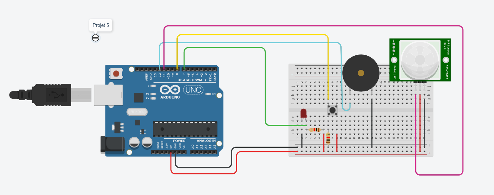

# Projet 5 : distance et buzzeur

## :clipboard: Sujet

> Mettez en place une carte Arduino avec un détecteur de mouvement. Lorsqu’un mouvement est détecté, un buzzeur doit s’enclencher et une LED soit s’allumer.​ Un bouton permettra d’éteindre le buzzeur.​

## :electric_plug: Le schéma



### Explication du schéma

Le schéma est simple et n'a pas de module complexe. 

Sur le schéma il y a :

- 2 éléments qui sont en entrées :
    - 1 bouton poussoir
    - 1 capteur infrarouge passif (détection de mouvement)
- 2 éléments qui sont en sortie :
    - 1 LED
    - 1 buzzer (pour le son)

Tous les composants sont branchés sur des **pins digitaux**.

## :computer: Le code

```c++
int led_pin = 7;
int btn_pin = 8;
int capt_pin = 11;
int buzzer_pin = 12;

bool isActive;

void setup()
{
    //Mise en place des pins des différents composants
    pinMode(led_pin, OUTPUT);
    pinMode(btn_pin, INPUT);
    pinMode(capt_pin, INPUT);
    pinMode(buzzer_pin, OUTPUT);
    
    Serial.begin(9600);
}

void loop()
{
    //On récupère la valeur du capteur infrarouge (valeur en TOR)
    bool detectionMovement = digitalRead(capt_pin); 

    //s'il y a détection de mouvement
    if(detectionMovement) {

        //On active le système
        isActive = true;

        //tant que le système est activé
        while(isActive) {
            
            //On allume la LED et on fait du son.
            digitalWrite(led_pin, HIGH);
            tone(buzzer_pin, 500);
            
            //On lit en permanence s'il y a un appuie sur le bouton de désactivation du système
            int btn_state = digitalRead(btn_pin);
            
            //S'il y a un appuie alors on désactive le système
            if(btn_state == HIGH) {
                Serial.print("im here");
                isActive = false;
            }
            
        }
    }

    //Si tout va bien on désactive tout.
    digitalWrite(led_pin, LOW);
    noTone(buzzer_pin);
}
```

### Explication du code

Pour expliquer globalement ce que l'on fait, dans un premier temps on récupère la valeur du détecteur pour savoir s'il est activé. Si c'est le cas alors, on va activer le système en rentrant dans une boucle ``while`` qui reste active tant qu'on qu'il n'y a pas eu d'appui sur le bouton. On vérifie a chaque tour que quelqu'un n'a pas appuyé sur un bouton. Si c'est le cas, alors on désactive le système en mettant la variable `isActive` à ``false``.

## :question: La question

### Comment fonctionne un capteur infrarouge ? Qu’est-ce que le PWM ?​

Pour le fonctionnement d'un capteur infrarouge : 

> A l'intérieur d'un détecteur de mouvement, le capteur infrarouge est chargé de mesurer en permanence le rayonnement infrarouge à l'intérieur de son champ de vision. Il est associé à un composant électronique qui mesure les variations d'intensité du signal perçu par le capteur. Quand le capteur enregistre une variation subite, c'est le signe qu'un être vivant est passé en face du capteur infrarouge. - [Securitas Direct](https://www.securitasdirect.fr/mag-securite/systeme-d-alarme/composants/alarme-coeur-du-systeme/fonctionnement-d-un-capteur-infrarouge)

Pour simplifier : le capteur infrarouge va regarder en permanence les variations d'intensité d'un signal infrarouge et s'il y a une variation, alors il y a eu un mouvement et le capteur renvoie l'information.

Le PWM pour Pulse Width Modulation ou MLI en français pour Modulation de largeur d’impulsion, est un signal de fréquence constante et de rapport cyclique variable. C'est-à-dire que le résultat sera toujours le même, mais que dans une même fréquence le pourra être différent.

De ce que l'on a compris, dans l'exemple de la LED qui récupère des valeurs en TOR (donc HIGH ou LOW): La fréquence reste la même, c'est-à-dire que le temps écoulé pour un cycle HIGH + LOW reste le même. En revanche, le temps écoulé entre la position éteinte et allumée peut varier. 

Exemple avec des schémas venant de [locoduino.org](https://www.locoduino.org/spip.php?article47#nb3) :


**PMW à 50%** : La fréquence est de 100Hz, le rapport cyclique de 50%.


**PWM à 10%** : La fréquence est de 100Hz et le rapport cyclique de 10%. 

Dans le dernier schéma, la fréquence est de 10ms mais le temps où la LED est allumée est de 1ms tandis qu'elle reste éteinte pendant 9ms. Elle est donc allumée seulement 10% du temps lors d'une fréquence.

*N'oublions pas que 1Hz = 1000ms soit 100Hz = 10ms.*

[<-- Projet 4](../Projet_4/projet4.md) | 5 | [Projet 6 -->](../Projet_6/projet6.md)


