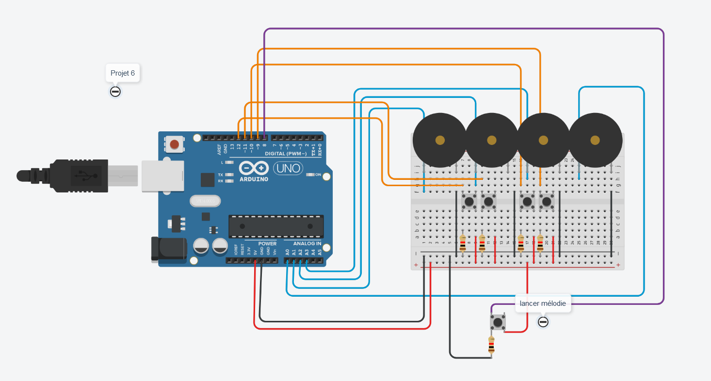

# Projet 6 : un peu de musique

## :clipboard: Sujet

> Mettez en place une carte Arduino avec plusieurs buzzeurs reliés à elle.​ Trouvez un moyen pour que l’utilisateur puisse jouer une « mélodie » à partir de ces buzzeurs.​ Vous préparerez aussi une mélodie pré-enregistré que l’utilisateur pourra jouer en appuyant sur un bouton. ​

​

## :electric_plug: Le schéma



### Explication du schéma

Le schéma n'est pas très optimisé (niveau lisibilité et au niveau de l'utilisation des composants).

- Nous avons 4 buzzers relier simplement aux pins analogiques.
- Nous avons 5 boutons : 4 pour les notes et 1 pour jouer un air de musique entier.

> :bulb: À noter que l'utilisation de 4 buzzers est en réalité inutile car nous pourrions juste changer la valeur de la "note" en fonction du bouton utilisé.

## :computer: Le code

```c++
// Définition des fréquences des notes de musiques de la 4ème octave
#define OCTAVE_4_DO 523
#define OCTAVE_4_RE 587
#define OCTAVE_4_MI 659
#define OCTAVE_4_FA 698
#define OCTAVE_4_SOL 784
#define OCTAVE_4_LA 880
#define OCTAVE_4_SI 988

#define DUREE_TEMPS 300

int first_buzz = A0;
int second_buzz = A1;
int third_buzz = A2;
int fourth_buzz = A3;

int first_btn = 12;
int second_btn = 11;
int third_btn = 10;
int fourth_btn = 9;

int play_melody_btn = 8;

void setup()
{ 
  	pinMode(first_btn, INPUT);	
  	pinMode(second_btn, INPUT);
	pinMode(third_btn, INPUT);
	pinMode(fourth_btn, INPUT);
  	pinMode(play_melody_btn, INPUT);
}

void loop()
{
  
    //Si on appuie sur le bouton pour jouer la mélodie alors on joue auClairDeLaLune().
    if(digitalRead(play_melody_btn)){
        auClairDeLaLune();
    }

    //Si on appuie sur le bouton du DO on joue, sinon on désactive le buzzeur
    if(digitalRead(first_btn)) {
        tone(first_buzz, OCTAVE_4_DO);
    } else {
        noTone(first_buzz);
    }

    //Si on appuie sur le bouton du MI on joue, sinon on désactive le buzzeur
    if(digitalRead(second_btn)) {
        tone(second_buzz, OCTAVE_4_MI);
    } else {
        noTone(second_buzz);
    }

    //Si on appuie sur le bouton du FA on joue, sinon on désactive le buzzeur
    if(digitalRead(third_btn)) {
        tone(third_buzz, OCTAVE_4_FA); 
    } else {
        noTone(third_buzz);
    }

    //Si on appuie sur le bouton du SOL on joue, sinon on désactive le buzzeur
    if(digitalRead(fourth_btn)) {
        tone(fourth_buzz, OCTAVE_4_SOL);
    } else {
        noTone(fourth_buzz);
    }
  
}

//Fonction permettant de jouer "au clair de la lune" avec le buzzeur 1.
void auClairDeLaLune() {
    // Jeux des 11 premières notes de "Au clair de la lune"
    // (trouvé sur Internet ici : https://tropratik.fr/au-clair-de-la-lune-avec-arduino)
    tone(first_buzz, OCTAVE_4_DO, DUREE_TEMPS);
    delay(DUREE_TEMPS);
    tone(first_buzz, OCTAVE_4_DO, DUREE_TEMPS);
    delay(DUREE_TEMPS);
    tone(first_buzz, OCTAVE_4_DO, DUREE_TEMPS);
    delay(DUREE_TEMPS);
    tone(first_buzz, OCTAVE_4_RE, DUREE_TEMPS);
    delay(DUREE_TEMPS);
    tone(first_buzz, OCTAVE_4_MI, 2 * DUREE_TEMPS);
    delay(2 * DUREE_TEMPS);
    tone(first_buzz, OCTAVE_4_RE, 2 * DUREE_TEMPS);
    delay(2 * DUREE_TEMPS);
    tone(first_buzz, OCTAVE_4_DO, DUREE_TEMPS);
    delay(DUREE_TEMPS);
    tone(first_buzz, OCTAVE_4_MI, DUREE_TEMPS);
    delay(DUREE_TEMPS);
    tone(first_buzz, OCTAVE_4_RE, DUREE_TEMPS);
    delay(DUREE_TEMPS);
    tone(first_buzz, OCTAVE_4_RE, DUREE_TEMPS);
    delay(DUREE_TEMPS);
    tone(first_buzz, OCTAVE_4_DO, 4 * DUREE_TEMPS);
    delay(4 * DUREE_TEMPS); 
    noTone(first_buzz);
}
```

### Explication du code

> :bulb: Tout d'abord, ce qui se trouve dans la fonction `auClairDeLaLune()` a été trouvé sur [tropratik.fr](https://tropratik.fr/au-clair-de-la-lune-avec-arduino)

Afin de répondre au sujet, nous avons décidé de jouer avec 4 notes qui seront jouables via 4 boutons. Chaque bouton jouera donc une note différente ce qui permettra de faire une mélodie (comme par exemple le thème de Mario :wink:).

Nous avons donc 5 conditions dans la boucle ``loop()`` : 

- La première correspond au bouton qui permet de lancer une mélodie déjà conçue entièrement, celle de **Au Clair De La Lune**.
- Les 4 dernières conditions font la même chose : Elles permettent de vérifier si le bouton a été activé, si oui alors on allume le buzzer avec une note défini.
    - Pour ces conditions, on aurait pu améliorer le code en ayant mis des conditions qui changent seulement la valeur de la note.


## :question: La question

### Quelles sont les principales différences entre les cartes Arduino Uno et Arduino MKR ? Et au niveau du micro-processeur ?

Afin de comparer l'Arduino Uno et Arduino MKR, nous avons fait un tableau comparatif :

| *Élément de comparaison/Arduino* | UNO R3 | MKR Wifi 1010 |
|--|--|--|
| ***Prix*** | ~20€ | ~30€ |
| ***Digital I/O Pins*** | 14 | 8 |
| ***PWM Pins*** | 6 | 13 |
| ***Analog Input Pins*** | 6 | 6 |
| ***Flash Memory*** | 32 KB | 256 KB |
| ***SRAM*** | 2 KB | 32 KB |
| ***EEPROM*** | 1 KB | no |
| ***Fréquence d'horloge*** | 16 MHz | 48 MHz |

Les grandes différences entre l'Arduino Uno et Arduino MKR sont que ce dernier est fait pour du développement rapide mais surtout utiliser pour l'IoT car fonctionne sous des plateformes de connectivités spécifiques. En revanche l'Arduino Uno connaît une plus grande base d'utilisateurs et par conséquent, il existe beaucoup de modules/fonctions. De plus l'arduino Uno a une multitude de blindages compatibles. L'Arduino MKR a besoin d'un adaptateur pour accéder à certains blindages de la UNO.

Au niveau du micro-processeur, on est sur quelque chose de totalement différent. L'arduino Uno possède un microcontrôleur nommé **ATMEGA328P** et l'Arduino MKR possède un microcontrôleur nommé **SAMD21 Cortex®-M0+**. Premièrement, le CPU ne possède pas le même nombre de Flash Memory (Mémoire garder par l'arduino lors de la mise hors tension) et de SRAM (La mémoire vive statique). De plus, le micro-processeur du Arduino Uno a une fréquence d'horloge moins rapide que celle du MKR. Ce qui veut dire que les traitements sont plus rapide et que le débit d'information est plus élevé sur le MKR que sur le UNO.

[<-- Projet 5](../Projet_5/projet5.md) | 6 |


